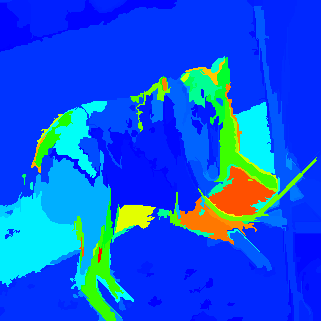
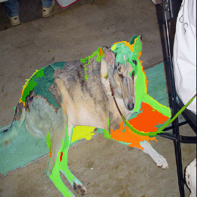

### Introducation

This is an project which convers a img which values is between [0,1] to a rgb-heatmap.

### Preparation

to use this project, you have to install some packages:

> pip install scikit-image
>
> pip install numpy

### Usage

to run the heatmap.py, you only need to do:

> python heatmap.py img/test.png  img/heatmap.npy img/

and it will output two heatmap images. The file "heatmap1.png" is only a colored heatmap. The file "heatmap2.png" combines the colored heatmap with its origin image.

**NOTE**: the file "heatmap.npy" contains the heatmap data.

### Result

origin image:

heatmap with color:

heatmap with origin image:

